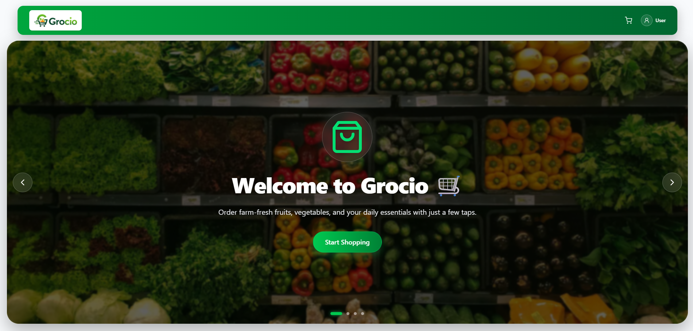

<div align="center">

# 🛒 Grocio

### Modern Full-Stack 10-Minute Grocery Delivery Ecosystem



<p align="center">
A lightning-fast, production-ready full-stack grocery delivery platform built with <strong>Next.js 14</strong>, <strong>TypeScript</strong>, <strong>MongoDB</strong>, and a standalone <strong>Socket.io</strong> server to deliver seamless real-time communication between customers, administrators, and delivery partners.
</p>


</div>

---

# 🌐 Live Production Links

🔗 **Frontend Application:**  
https://grocio-three.vercel.app/

🔗 **Real-Time Socket Server:**  
https://grocio-server.onrender.com

---

# 📂 Source Code Repositories

- **Frontend (Client):** https://github.com/rohan-bhau/Grocio
- **Backend (Socket Server):** https://github.com/rohan-bhau/Grocio-server

---

# 📖 Project Overview

Grocio is a modern full-stack grocery delivery platform designed for hyperlocal delivery services with real-time communication at its core. The application enables customers, administrators, and delivery partners to stay synchronized instantly using Socket.io, ensuring a smooth and responsive delivery experience.

The frontend is built with **Next.js 14**, **TypeScript**, and **Redux Toolkit**, while all real-time communication is handled through a dedicated standalone **Express + Socket.io** server deployed separately from the client. This architecture keeps WebSocket connections persistent while maintaining the scalability benefits of serverless deployment.

---

# ✨ Core Application Features

## 👤 Customer Features

- Secure authentication with NextAuth.
- Dynamic shopping cart powered by Redux Toolkit.
- Instant order placement with real-time synchronization.
- Live order status tracking.
- Real-time courier location tracking using browser geolocation.
- Two-way real-time chat with the assigned delivery partner.
- AI-powered smart reply suggestions powered by Gemini 1.5 Flash.

---

## 👨‍💼 Admin Features

- Live dashboard displaying newly placed orders instantly.
- Complete product management (Create, Read, Update & Delete).
- Order management with real-time status updates.
- Delivery partner assignment system.
- Broadcast notifications for nearby delivery partners.
- Business analytics and revenue overview dashboard.

---

## 🛵 Delivery Partner Features

- Real-time incoming delivery requests.
- One-click order acceptance.
- Continuous background GPS location streaming.
- Live customer messaging.
- AI-powered smart reply suggestions.
- OTP-based secure delivery verification before completing an order.

---

# 🚀 Engineering Highlights

- Dedicated standalone Socket.io server architecture.
- Multi-room communication using `orderId`.
- Live location synchronization.
- AI-powered chat assistance.
- Automatic fallback responses when AI services are unavailable.
- Optimized loading skeletons for improved UX.
- Secure CORS configuration.
- Automatic dashboard redirection after order completion.

---

# 🛠 Technology Stack

## Frontend

- Next.js 14 (App Router)
- React 18
- TypeScript
- Tailwind CSS
- Redux Toolkit
- Axios
- Socket.io Client
- React Hot Toast
- Lucide React

### Backend

- Node.js
- Express.js
- Socket.io
- MongoDB Atlas
- Mongoose
- Nodemailer

---

# 📁 Project Structure

```bash
Grocio-Workspace
│
├── Grocio-client
│   ├── src
│   │   ├── app
│   │   │   ├── admin
│   │   │   ├── user
│   │   │   ├── delivery
│   │   │   └── api
│   │   ├── components
│   │   ├── redux
│   │   ├── lib
│   │   └── models
│   │
│   └── public
│
└── Grocio-server
    ├── index.js
    └── package.json
```

---

# ⚙️ Real-Time Workflow

```text
Customer Places Order
          │
          ▼
Socket Emits "new-order"
          │
          ▼
Admin Dashboard Receives Order
          │
          ▼
Delivery Partner Assigned
          │
          ▼
Live GPS Location Streaming
          │
          ▼
Customer Order Tracking
          │
          ▼
Two-Way Real-Time Chat
          │
          ▼
OTP Verification
          │
          ▼
Order Successfully Delivered
```

---

# 🔒 Environment Variables

## Frontend (`Grocio-client/.env.local`)

```env
# Database
MONGODB_URI=mongodb+srv://<username>:<password>@cluster.mongodb.net/grocio

# Authentication
NEXTAUTH_SECRET=your_nextauth_secret

# API Configuration
NEXT_PUBLIC_API_BASE_URL=http://localhost:3000
NEXT_PUBLIC_SOCKET_SERVER_URL=https://grocio-server.onrender.com

# Google Gemini
GEMINI_API_KEY=your_gemini_api_key

# Email Service
EMAIL_SERVICE_USER=your_email@gmail.com
EMAIL_SERVICE_PASSWORD=your_app_password
```

## Backend (`Grocio-server/.env`)

```env
PORT=4000

FRONTEND_URL=https://grocio-three.vercel.app

NEXT_BASE_URL=https://grocio-server.onrender.com
```

---

# 🚀 Installation & Setup

## Run Socket Server

```bash
cd Grocio-server

npm install

npm start
```

## Run Frontend Application

```bash
cd Grocio-client

npm install

npm run dev
```

---

# 👨‍💻 Author

**MD Rohan Mia**

**MERN Stack Developer**

GitHub:  
https://github.com/rohan-bhau

**Specialization**

- Next.js
- MERN Stack
- Socket.io
- Real-Time Applications
- Distributed System Architecture

---

# 🌟 Support

If you found this project helpful, consider giving the repository a ⭐ on GitHub.

Your support motivates me to build more production-ready open-source projects.

---

<div align="center">

### Built with ❤️ using Next.js, TypeScript, MongoDB, Socket.io & Redux Toolkit.

</div>
